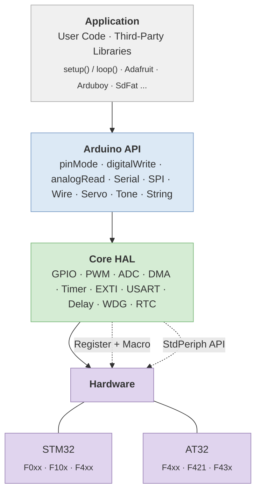

# Arduino for Keil

[](https://deepwiki.com/FASTSHIFT/Arduino-For-Keil)

> [English](README_EN.md) | 中文

## 概述

Arduino for Keil 是 [Arduino](https://www.arduino.cc) 框架的一个轻量级实现，使 [AT32](https://www.arterytek.com) / [STM32](https://www.st.com.cn) 系列单片机能够支持 [Arduino 语法](https://www.arduino.cc/reference/en)，并在 [Keil MDK](https://www.keil.com) 环境中进行编译与调试。

### 为什么选择 Arduino for Keil？

- **共享 Arduino 生态** — 直接复用数以千计的 [Arduino 库](https://github.com/topics/arduino-library)（Adafruit、Arduboy、SdFat 等），大幅降低开发成本。
- **优化的硬件操控** — 采用 **寄存器 + 宏** 优化策略，减少函数调用开销，接近裸机性能。
- **精简的框架设计** — 相较于 [stm32duino](https://github.com/stm32duino) 和 [HAL](https://github.com/STMicroelectronics/stm32f1xx-hal-driver)，代码体积更小，编译速度更快。
- **灵活的开发模式** — 在同一项目中自由混合使用 Arduino API、标准外设库函数和寄存器直接操作。

### 支持平台

| 厂商   | MCU 系列   | 平台目录             |
|--------|------------|---------------------|
| ST     | STM32F0xx  | `Platform/STM32F0xx` |
| ST     | STM32F10x  | `Platform/STM32F10x` |
| ST     | STM32F4xx  | `Platform/STM32F4xx` |
| 雅特力 | AT32F4xx   | `Platform/AT32F4xx`  |
| 雅特力 | AT32F421   | `Platform/AT32F421`  |
| 雅特力 | AT32F43x   | `Platform/AT32F43x`  |

## 系统架构



## 快速开始

1. 安装对应平台的固件包（详见 [Packs](Packs)）。

   > ⚠️ 如果已安装更高版本的固件包，请先使用 Keil 自带的包管理工具进行卸载（Remove）。

2. 打开 [Keilduino/Platform](Keilduino/Platform)，选择对应 MCU 型号的目录。
3. 打开 `MDK-ARM` 文件夹内的 Keil 工程文件（`.uvprojx`）。
4. 在 `main.cpp` 中使用 `setup()` 和 `loop()` 编写代码：

```cpp
#include <Arduino.h>

static void setup()
{
    Serial.begin(115200);
    pinMode(PA0, OUTPUT);
}

static void loop()
{
    digitalWrite(PA0, HIGH);
    delay(1000);
    digitalWrite(PA0, LOW);
    delay(1000);
}
```

### 混合开发模式

支持 Arduino API、标准外设库函数和寄存器直接操作混合使用：

```cpp
void setup()
{
    pinMode(PA0, OUTPUT);               // Arduino API
}

void loop()
{
    GPIOA->BSRR = GPIO_Pin_0;          // 寄存器直接操作
    delay(1000);
    GPIO_ResetBits(GPIOA, GPIO_Pin_0);  // 标准外设库函数
    delay(1000);
}
```

## 项目结构

```
Keilduino/
├── Application/          # 用户代码 (main.cpp)
├── ArduinoAPI/           # Arduino 兼容 API 层
│   ├── Arduino.h/c       # 核心 API (pinMode, digitalWrite, analogRead ...)
│   ├── HardwareSerial     → 平台相关实现
│   ├── SPI                → 平台相关实现
│   ├── Wire.h/cpp        # 软件 I2C
│   ├── Print / Stream    # 基础 I/O 类
│   ├── WString           # Arduino String 类
│   ├── Tone              # 蜂鸣器音调生成
│   └── WMath             # 数学工具
├── Libraries/            # 内置库 (Servo 等)
└── Platform/             # MCU 平台相关实现
    ├── STM32F0xx/
    ├── STM32F10x/
    ├── STM32F4xx/
    ├── AT32F4xx/
    ├── AT32F421/
    └── AT32F43x/
        ├── Config/       # mcu_config.h (外设使能/禁用、引脚映射)
        ├── Core/         # HAL 驱动 (GPIO, ADC, PWM, Timer, EXTI, USART ...)
        └── MDK-ARM/      # Keil 工程文件
```

## 示例代码

示例代码位于 [Example](Example) 目录：

| 示例 | 说明 |
|------|------|
| [Basic.cpp](Example/Basic.cpp) | GPIO、PWM、ADC、串口综合示例 |
| [PWM.cpp](Example/PWM.cpp) | PWM 初始化与占空比控制 |
| [Timer.cpp](Example/Timer.cpp) | 定时器中断回调 |
| [USART.cpp](Example/USART.cpp) | 串口通信与中断 |
| [ADC_DMA.cpp](Example/ADC_DMA.cpp) | 多通道 ADC + DMA 采集 |
| [EXTI.cpp](Example/EXTI.cpp) | 外部中断（按键检测） |
| [GPIO_Fast.cpp](Example/GPIO_Fast.cpp) | 快速 GPIO 宏操作 |

## 第三方库移植

请参考 [Arduino 库移植指南](Arduino%20Library%20Porting%20Guide)。

## 注意事项

- 请勿删除 `main.cpp` 中的 `main` 函数。
- 添加第三方库时，需提供完整的头文件路径，并将所有 `.cpp` 源文件添加到 Keil 工程中。
- 部分库可能需要针对平台差异进行少量修改，请参考编译器错误提示或提交 [Issue](https://github.com/FASTSHIFT/Arduino-For-Keil/issues)。

## 许可证

MIT License — Copyright (c) 2017 - 2025 _VIFEXTech
