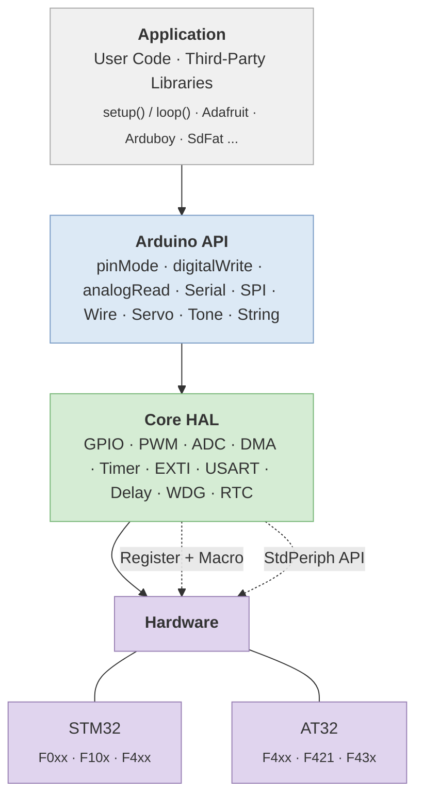

# Arduino for Keil

[](https://deepwiki.com/FASTSHIFT/Arduino-For-Keil)

> English | [中文](README.md)

## Overview

Arduino for Keil is a lightweight implementation of the [Arduino](https://www.arduino.cc) framework, enabling [AT32](https://www.arterytek.com) / [STM32](https://www.st.com.cn) series MCUs to support [Arduino syntax](https://www.arduino.cc/reference/en) with compilation and debugging in the [Keil MDK](https://www.keil.com) environment.

### Why Arduino for Keil?

- **Leverage the Arduino Ecosystem** — Directly reuse thousands of [Arduino libraries](https://github.com/topics/arduino-library) (Adafruit, Arduboy, SdFat, etc.), significantly reducing development effort.
- **Optimized Hardware Access** — Uses **register + macro** optimization to minimize function call overhead, achieving near bare-metal performance.
- **Minimal Footprint** — Compared to [stm32duino](https://github.com/stm32duino) and [HAL](https://github.com/STMicroelectronics/stm32f1xx-hal-driver), this project delivers smaller code size and faster compilation.
- **Flexible Development** — Freely mix Arduino API, Standard Peripheral Library, and direct register access in the same project.

### Supported Platforms

| Vendor | MCU Family | Platform Directory |
|--------|------------|--------------------|
| ST     | STM32F0xx  | `Platform/STM32F0xx` |
| ST     | STM32F10x  | `Platform/STM32F10x` |
| ST     | STM32F4xx  | `Platform/STM32F4xx` |
| Artery | AT32F4xx   | `Platform/AT32F4xx`  |
| Artery | AT32F421   | `Platform/AT32F421`  |
| Artery | AT32F43x   | `Platform/AT32F43x`  |

## Architecture



## Getting Started

1. Install the firmware pack for your target platform (see [Packs](Packs)).

   > ⚠️ If a newer version of the pack is already installed, uninstall (Remove) it first using Keil's built-in Pack Manager.

2. Open [Keilduino/Platform](Keilduino/Platform) and select the directory matching your MCU.
3. Open the Keil project file (`.uvprojx`) inside the `MDK-ARM` folder.
4. Write your code in `main.cpp` using `setup()` and `loop()`:

```cpp
#include <Arduino.h>

static void setup()
{
    Serial.begin(115200);
    pinMode(PA0, OUTPUT);
}

static void loop()
{
    digitalWrite(PA0, HIGH);
    delay(1000);
    digitalWrite(PA0, LOW);
    delay(1000);
}
```

### Mixed-Mode Development

Arduino API, Standard Peripheral Library functions, and direct register operations can be used together:

```cpp
void setup()
{
    pinMode(PA0, OUTPUT);               // Arduino API
}

void loop()
{
    GPIOA->BSRR = GPIO_Pin_0;          // Direct register access
    delay(1000);
    GPIO_ResetBits(GPIOA, GPIO_Pin_0);  // Standard Peripheral Library
    delay(1000);
}
```

## Project Structure

```
Keilduino/
├── Application/          # User code (main.cpp)
├── ArduinoAPI/           # Arduino-compatible API layer
│   ├── Arduino.h/c       # Core API (pinMode, digitalWrite, analogRead ...)
│   ├── HardwareSerial     → Platform-specific
│   ├── SPI                → Platform-specific
│   ├── Wire.h/cpp        # Software I2C
│   ├── Print / Stream    # Base I/O classes
│   ├── WString           # Arduino String class
│   ├── Tone              # Tone generation
│   └── WMath             # Math utilities
├── Libraries/            # Built-in libraries (Servo, etc.)
└── Platform/             # MCU-specific implementations
    ├── STM32F0xx/
    ├── STM32F10x/
    ├── STM32F4xx/
    ├── AT32F4xx/
    ├── AT32F421/
    └── AT32F43x/
        ├── Config/       # mcu_config.h (peripheral enable/disable, pin mapping)
        ├── Core/         # HAL drivers (GPIO, ADC, PWM, Timer, EXTI, USART ...)
        └── MDK-ARM/      # Keil project file
```

## Examples

Example code is available in the [Example](Example) directory:

| Example | Description |
|---------|-------------|
| [Basic.cpp](Example/Basic.cpp) | GPIO, PWM, ADC, Serial |
| [PWM.cpp](Example/PWM.cpp) | PWM initialization and duty cycle control |
| [Timer.cpp](Example/Timer.cpp) | Timer interrupt callbacks |
| [USART.cpp](Example/USART.cpp) | Serial communication with interrupt |
| [ADC_DMA.cpp](Example/ADC_DMA.cpp) | Multi-channel ADC with DMA |
| [EXTI.cpp](Example/EXTI.cpp) | External interrupt (button press) |
| [GPIO_Fast.cpp](Example/GPIO_Fast.cpp) | Fast GPIO macros for high-speed I/O |

## Porting Arduino Libraries

See the [Arduino Library Porting Guide](Arduino%20Library%20Porting%20Guide) for a step-by-step walkthrough.

## Notes

- Do **not** remove the `main` function in `main.cpp`.
- When adding third-party libraries, provide the full include path and add all `.cpp` source files to the Keil project.
- Some libraries may require minor modifications for platform compatibility. Check compiler error messages or open an [issue](https://github.com/FASTSHIFT/Arduino-For-Keil/issues).

## License

MIT License — Copyright (c) 2017 - 2025 _VIFEXTech
